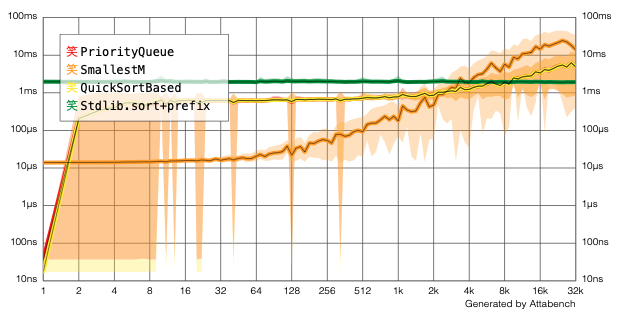

# Minima and/or Maxima

[[Source](https://github.com/apple/swift-algorithms/blob/main/Sources/Algorithms/MinMax.swift) | 
 [Tests](https://github.com/apple/swift-algorithms/blob/main/Tests/SwiftAlgorithmsTests/MinMaxTests.swift)]

Returns the smallest or largest elements of this collection, sorted by a predicate or in the order defined by `Comparable` conformance.

If you need to sort a collection but only need access to a prefix or suffix of the sorted elements, using these methods can give you a performance boost over sorting the entire collection. The order of equal elements is guaranteed to be preserved.

```swift
let numbers = [7, 1, 6, 2, 8, 3, 9]
let smallestThree = numbers.min(count: 3, sortedBy: <)
// [1, 2, 3]
```

Return the smallest and largest elements of this sequence, determined by a predicate or in the order defined by `Comparable` conformance.

If you need both the minimum and maximum values of a collection, using these methods can give you a performance boost over running the `min` method followed by the `max` method. Plus they work with single-pass sequences.

```swift
let numbers = [7, 1, 6, 2, 8, 3, 9]
if let (smallest, largest) = numbers.extrema(by: <) {
    // Work with 1 and 9....
}
```

## Detailed Design

This adds the `Collection` methods shown below:

```swift
extension Collection {
    public func min(
        count: Int, 
        sortedBy areInIncreasingOrder: (Element, Element) throws -> Bool
    ) rethrows -> [Element]
    
    public func max(
        count: Int, 
        sortedBy areInIncreasingOrder: (Element, Element) throws -> Bool
    ) rethrows -> [Element]
}
```

And the `Sequence` method:

```swift
extension Sequence {
    public func extrema(
        by areInIncreasingOrder: (Element, Element) throws -> Bool
    ) rethrows -> (min: Element, max: Element)?
}
```

Additionally, versions of these methods for `Comparable` types are also provided:

```swift
extension Collection where Element: Comparable {
    public func min(count: Int) -> [Element]

    public func max(count: Int) -> [Element]
}

extension Sequence where Element: Comparable {
    public func extrema() -> (min: Element, max: Element)?
}
```

### Complexity

The algorithm used for an extrema block is based on [Soroush Khanlou's research on this matter](https://khanlou.com/2018/12/analyzing-complexity/). The total complexity is `O(k log k + nk)`, which will result in a runtime close to `O(n)` if *k* is a small amount. If *k* is a large amount (more than 10% of the collection), we fall back to sorting the entire array. Realistically, this means the worst case is actually `O(n log n)`.

Here are some benchmarks we made that demonstrates how this implementation (SmallestM) behaves when *k* increases (before implementing the fallback):




The algorithm used for simultaneous minimum and maximum is the straightforward approach. At each iteration, either one or two comparisons will be needed. Assuming the chances for each comparison count are approximately equal, then 1.5 times the sequence length is the average count of comparisons needed.

### Comparison with other languages

**C++:** The `<algorithm>` library defines a `partial_sort` function where the entire array is returned using a partial heap sort. It also defines a `minmax_element` function that scans a range for its minimal and maximal elements.

**Python:** Defines a `heapq` priority queue that can be used to manually achieve the same result.

